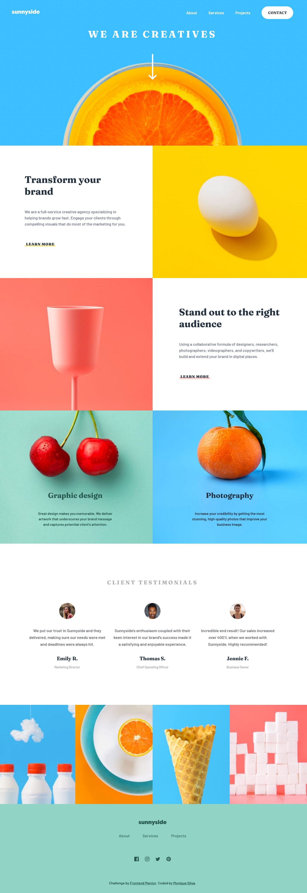

# Frontend Mentor - Sunnyside agency landing page solution

This is a solution to the [Sunnyside agency landing page challenge on Frontend Mentor](https://www.frontendmentor.io/challenges/sunnyside-agency-landing-page-7yVs3B6ef). Frontend Mentor challenges help you improve your coding skills by building realistic projects.

## Table of contents

- [Overview](#overview)
  - [The challenge](#the-challenge)
  - [Screenshot](#screenshot)
  - [Links](#links)
- [My process](#my-process)
  - [Built with](#built-with)
  - [What I learned](#what-i-learned)
- [Author](#author)

## Overview

### The challenge

Users should be able to:

- View the optimal layout for the site depending on their device's screen size
- See hover states for all interactive elements on the page

### Screenshot

### Links

- Solution URL: [Add solution URL here](https://your-solution-url.com)
- [Live Site](https://mss-sunnyside-agency.netlify.app/)

## My process

### Built with

- Semantic HTML5 markup
- CSS custom properties
- Flexbox
- CSS Grid
- Mobile-first workflow
- [Vue](https://v3.vuejs.org/) - JS library
- [SASS](https://sass-lang.com/) - CSS preprocessor 

### What I learned

In this project I used Vue, explored new structures and new ways of styling. Navbar mobile version was particularly challenging, but I got a better understanding of how CSS transitions works and I hope to have less problems next time.

I used BEM and SASS, I'm not sure if it was the best way, but it certainly flowed better in this project than the previous one, I'm starting to understand how to use and apply them better.

That's it, keep learning!

## Author

- Linkedin - [Monique Santos](https://www.linkedin.com/in/moniquesilva95/)
- Frontend Mentor - [@moniquedsilva](https://www.frontendmentor.io/profile/moniquedsilva)
- Twitter - [@moniquesdsilva](https://twitter.com/moniquesdsilva)
